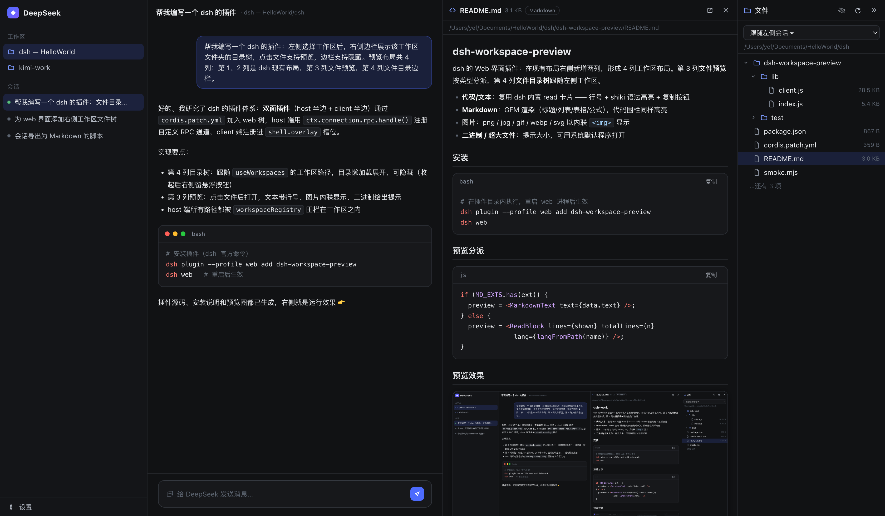

<p align="center">
  
</p>

# dsh-workspace-preview

<p align="center">
  <a href="https://badgen.net/badge/license/MIT/green"></a>
  <a href="https://badgen.net/badge/version/0.3.4/8257D0"></a>
  <a href="https://badgen.net/badge/format/official%20bundle%20plugin/8257D0"></a>
</p>

<p align="center"><strong>English</strong> | <a href="#中文">中文</a></p>

**dsh-workspace-preview** is a [DeepSeek Harness (dsh)](https://github.com/deepseek-ai/deepseek-harness) web plugin that turns the workspace into a four-column workbench:

```
┌────────────┬────────────────┬──────────────┬──────────────┐
│  Column 1  │   Column 2     │   Column 3   │   Column 4   │
│  sessions  │  conversation  │  file preview│  file tree   │
│  (dsh core)│  (dsh core)    │  (dsh-workspace-preview)  │  (dsh-workspace-preview)  │
└────────────┴────────────────┴──────────────┴──────────────┘
```

Select a workspace in the left sidebar and column 4 shows its directory tree; click a file to preview it in column 3. The tree sidebar can be hidden (a floating rail stays at the right edge) and both columns are drag-resizable. **Zero runtime dependencies** — the fence, the preview API and the Office parser are hand-written Node built-ins only.

## Features (v0.3)

**Column 4 — workspace file tree**

- Follows the workspace selected in the left sidebar (session-aware), with an in-panel workspace switcher
- Lazy per-directory loading (**opendir-streamed**), dirs-first natural sort, hidden-file toggle, refresh
- **Symlinks resolved to their target kind** (a directory symlink expands like a directory, flagged `↳`); **dangling links flagged** (name shown in the error color)
- **Filename search** (magnifier button): case-insensitive substring search under the current workspace root, debounced, budgeted (50k dirs / 500 results), directories can be clicked to reveal-and-expand them in the tree
- Hover any row for inline **rename** and **delete** (two-step confirm, recursive for directories)
- Hide with the `»` button; re-open from the floating rail; drag-resize (200–480 px)

**Column 3 — viewer registry preview (data-driven dispatch)**

| Viewer | Behavior |
|---|---|
| Code / text | dsh `ReadBlock`: line numbers + shiki (30+ languages) + copy; first 3000 lines |
| Markdown | Rendered GFM via dsh's `MarkdownText`; **local images now point straight at the plugin's media route** (``) — no base64, no placeholder rewriting, browser-cached |
| HTML | Rendered page inside a **sandboxed iframe** that loads the `/html` route directly: the response carries a CSP `sandbox` header and the iframe adds the strict `sandbox=""` attribute (**dual boundary**); the URL is path-encoded so relative assets (`./style.css`, images) resolve back into the route |
| Images | `` straight from the media route (20 MiB cap; oversized files show a notice instead of a broken icon) |
| PDF (`.pdf`) | Inline page via the **browser's built-in PDF engine** — an `<iframe>` streams the raw bytes from the media route (`application/pdf`); no sandbox attribute because Chromium/Edge refuse to run their PDF engine inside a sandboxed frame (the media route fence + the engine's own process sandbox are the boundary). Same 20 MiB cap as images |
| Office (`.docx/.xlsx/.pptx`) | Structured preview whose **renderer lives in a lazy chunk** (`/bundle/office.js`, fetched on first office open); data is still parsed host-side by the zero-dep OOXML extractor |
| Legacy Office / binary / oversized | Notice + open-with |

The dispatch is a small **viewer registry** (`exts`/priority per viewer; needs: route / media / pdf / text / data) — adding a new format is one registry row plus an optional lazy chunk, no changes in the host's kind table for render-only formats.

**Edit & save** — text files that were not truncated can be edited in place inside a **CodeMirror 6 editor** (lazy chunk `/bundle/editor.js`, ~1 MB fetched on first edit; language-aware, line numbers, history, autocomplete; ⌘/Ctrl+S). Saves pass back the `mtimeMs` observed at read time. The host checks the optimistic lock **first**, then writes **atomically** (temp sibling + rename) — a concurrent external change is refused with a conflict notice and a crash never leaves a half-written file. JSON format button in edit mode.

## Architecture (v0.3)

Two transport faces, one workspace fence:

- **RPC channel** `/dsh-workspace-preview` (loopback): `list` (opendir + symlink/broken fields) · `search` (budgeted filename walk) · `read` (bounded preview incl. Office extraction) · `write` (mtimeMs conflict → atomic tmp+rename) · `rename` · `remove`
- **HTTP routes** on the shared webserver, all behind the same browser-trust fence as `/api` (loopback / `trustedHosts`, cross-site markers refused):
  - `GET /dsh-workspace-preview/media?path=…` — raw bytes for `` / Markdown images
  - `GET /dsh-workspace-preview/html/<encoded-path>` — HTML page with CSP `sandbox` header
  - `GET /dsh-workspace-preview/bundle/<name>.js` — allowlisted lazy chunks (ETag revalidated)
- Every filesystem path funnels through `canonicalInside()`: absolute → `fs.realpath` → prefix check against **every** `workspaceRegistry` root.

```
lib/index.js            host: RPC endpoints + media/html/bundle routes + fences
lib/office.js           zero-dep OOXML extractor (docx/xlsx/pptx)
lib/client.js           browser: viewer registry + lazy chunk loader + tree/preview/edit
lib/client-chunk-office.js  lazy chunk: Office render components + CSS (first-use fetch)
lib/client-chunk-editor.js  lazy chunk: CodeMirror editor (built from src-editor/ via scripts/build-editor.mjs)
src-editor/             build-time source for the editor chunk (not shipped)
scripts/build-editor.mjs    one-time esbuild build (devDeps only; runtime stays zero-dep)
cordis.patch.yml        single bundle insert row
test/smoke.mjs          RPC + HTTP route + fence smoke tests (self-contained)
```

## Install / update

```sh
dsh plugin --profile web add dsh-workspace-preview                     # npm
dsh plugin --profile web add "github:J-YeFen/dsh-workspace-preview"    # GitHub
dsh plugin --profile web add .                                         # local checkout
```

Restart the web process (`dsh web`) and refresh the browser. `lib/` artifacts are committed — consumers need **no build step**. Developers re-running the CodeMirror bundle (only after editing `src-editor/` or bumping CodeMirror devDependencies): `npm install && node scripts/build-editor.mjs`, then commit the artifact. Gate: `node --check lib/*.js && node test/smoke.mjs`.

## Security

- Every path (RPC and HTTP) passes the multi-root realpath workspace fence — the browser can never read arbitrary host files.
- HTTP routes additionally pass the browser-trust fence (loopback/trusted hosts; cross-site markers refused).
- HTML previews are double-sandboxed (route CSP `sandbox` header + iframe `sandbox=""`); the lazy chunk route is allowlisted.
- PDF previews stream raw bytes through the same media route, but the iframe deliberately carries **no** `sandbox` attribute — Chromium/Edge refuse to run their PDF engine in a sandboxed frame, so the boundary is the route's browser-trust fence plus the browser's own PDF-engine process sandbox (a PDF is never executed as page HTML).
- Hard caps bound every surface: 2000 list entries, 3 MiB read/write, 256 KiB text (HTML whole ≤ 3 MiB), 20 MiB media, 50k-dir / 500-result search.

## License

MIT

---

<a name="中文"></a>

# dsh-workspace-preview(中文)

**dsh-workspace-preview** 是 [DeepSeek Harness (dsh)](https://github.com/deepseek-ai/deepseek-harness) 的 web 插件,把工作区变成四列工作台:第 3 列文件预览,第 4 列可隐藏/可拖拽调宽的目录树。**零运行时依赖**(围栏、预览 API、Office 解析器全部是手写 Node 内置模块)。

## 功能(v0.3)

**第 4 列 —— 目录树**

- 跟随左侧会话工作区(面板内可下拉切换)
- 懒加载单层列表(**opendir 流式**),目录优先 + 自然排序,隐藏文件开关,刷新
- **软链接按目标类型展示**(目录软链可展开,`↳` 标记);**失效链接标红**
- **文件名搜索**(放大镜按钮):当前工作区根下的不区分大小写子串搜索,防抖 + 预算(5 万目录/500 条),命中目录可点击展开定位
- 行内**重命名**/**删除**(两步确认,目录递归);`»` 收起,右缘悬浮条展开;200–480px 拖拽调宽

**第 3 列 —— viewer 注册表预览(数据驱动分发)**

| Viewer | 行为 |
|---|---|
| 代码/文本 | dsh `ReadBlock`:行号 + shiki(30+ 语言)+ 复制;前 3000 行 |
| Markdown | GFM 渲染;**本地图片直指媒体路由**(``)——无 base64、无占位改写、可缓存 |
| HTML | 沙箱 iframe **直连 /html 路由**:响应带 CSP `sandbox` 头 + iframe `sandbox=""` 属性(**双边界**);路径编码 URL,相对资源(`./style.css`、图片)可解析 |
| 图片 | `` 直连媒体路由(20 MiB 上限,超限给提示而非破图) |
| PDF(`.pdf`) | 交给**浏览器内建 PDF 引擎**内联渲染——`<iframe>` 直连媒体路由原始字节(`application/pdf`);不带 sandbox 属性,因为 Chromium/Edge 拒绝在沙箱 iframe 里运行 PDF 引擎(边界 = 媒体路由围栏 + 引擎自身进程沙箱)。上限同图片 20 MiB |
| Office(`.docx/.xlsx/.pptx`) | 结构化预览,**渲染组件在懒 chunk 里**(`/bundle/office.js`,首次打开才拉取);数据仍由 host 端零依赖 OOXML 解析器提取 |
| 旧 Office/二进制/超大 | 提示 + 默认程序打开 |

分发走小型 **viewer 注册表**(按 exts/优先级;needs:路由/媒体/pdf/文本/数据)——加新格式 = 注册表加一行 + 可选懒 chunk,纯渲染类格式无需再动 host 的定型表。

**编辑与保存** —— 未截断文本可在 **CodeMirror 6 编辑器**内编辑(懒 chunk `/bundle/editor.js`,首次点编辑才拉取 ~1MB;语法高亮/行号/历史/自动补全,⌘/Ctrl+S);保存回传读取时的 `mtimeMs`,宿主**先做乐观锁校验、再原子落盘**(临时文件 + rename):外部并发改动被拒绝并提示,崩溃也不会留下半截文件。编辑态带 JSON 格式化按钮。

## 架构(v0.3)

双传输面、同一把工作区围栏:

- **RPC 通道** `/dsh-workspace-preview`(loopback):`list`(opendir + 软链/broken 字段)· `search`(预算化文件名遍历)· `read`(有界预览,含 Office 提取)· `write`(mtimeMs 冲突 → 原子写)· `rename` · `remove`
- **HTTP 路由**(与 `/api` 同源的浏览器信任围栏:loopback / `trustedHosts`,跨站标记拒绝):
  - `GET /dsh-workspace-preview/media?path=…` —— ``/Markdown 图片的原始字节
  - `GET /dsh-workspace-preview/html/<编码路径>` —— 带 CSP `sandbox` 头的 HTML 页面
  - `GET /dsh-workspace-preview/bundle/<name>.js` —— 白名单懒 chunk(ETag 校验)
- 所有文件路径过 `canonicalInside()`:绝对路径 → `fs.realpath` → 与 `workspaceRegistry` **全部根**做前缀校验。

```
lib/index.js            host:RPC 端点 + media/html/bundle 路由 + 围栏
lib/office.js           零依赖 OOXML 提取(docx/xlsx/pptx)
lib/client.js           浏览器:viewer 注册表 + 懒 chunk loader + 树/预览/编辑
lib/client-chunk-office.js  懒 chunk:Office 渲染组件 + CSS(首用拉取)
lib/client-chunk-editor.js  懒 chunk:CodeMirror 编辑器(由 src-editor/ 经 scripts/build-editor.mjs 构建)
src-editor/             编辑器 chunk 的构建期源码(不随包发布)
scripts/build-editor.mjs    一次性 esbuild 构建(仅 devDeps;运行时保持零依赖)
cordis.patch.yml        单行 bundle insert
test/smoke.mjs          RPC + HTTP 路由 + 围栏冒烟测试(自包含)
```

## 安装 / 更新

```sh
dsh plugin --profile web add dsh-workspace-preview                     # npm
dsh plugin --profile web add "github:J-YeFen/dsh-workspace-preview"    # GitHub
dsh plugin --profile web add .                                         # 本地目录
```

重启 web 进程(`dsh web`)并刷新页面生效。`lib/` 产物已提交,消费者**无需构建**。开发者要重打 CodeMirror bundle(仅在改 `src-editor/` 或升 CodeMirror devDeps 后):`npm install && node scripts/build-editor.mjs`,然后提交产物。质量门:`node --check lib/*.js && node test/smoke.mjs`。

## 安全

- 所有路径(RPC 与 HTTP)过**多根 realpath 工作区围栏**——浏览器无法读取任意宿主文件。
- HTTP 面再加**浏览器信任围栏**(loopback/信任主机;跨站标记拒绝)。
- HTML 预览**双沙箱**(路由 CSP `sandbox` 头 + iframe `sandbox=""`);懒 chunk 路由白名单化。
- PDF 预览同样走媒体路由取原始字节,但 iframe **刻意不带** `sandbox` 属性——Chromium/Edge 拒绝在沙箱 iframe 里运行 PDF 引擎;边界 = 路由的浏览器信任围栏 + 浏览器自己的 PDF 引擎进程沙箱(PDF 永不作为页面 HTML 执行)。
- 硬上限兜底:2000 条目 / 3 MiB 读写 / 256 KiB 文本(HTML 整文件 ≤ 3 MiB)/ 20 MiB 媒体 / 5 万目录、500 条搜索。

## License

MIT
